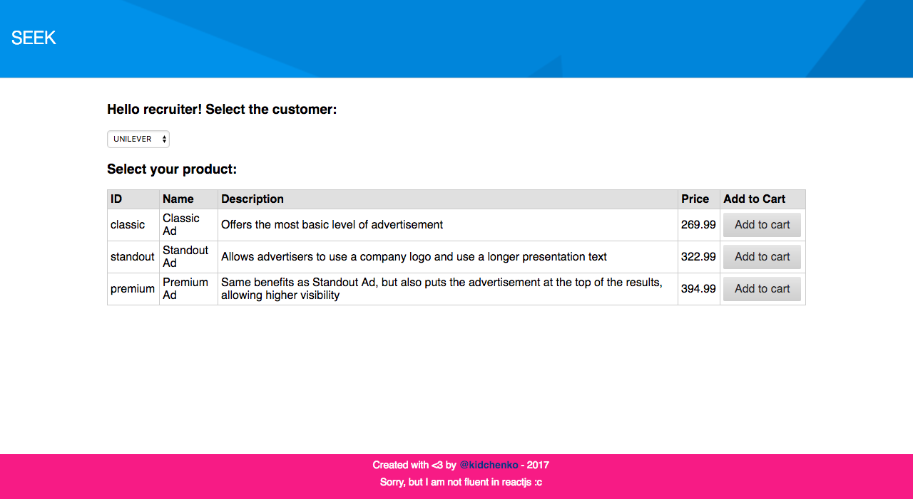
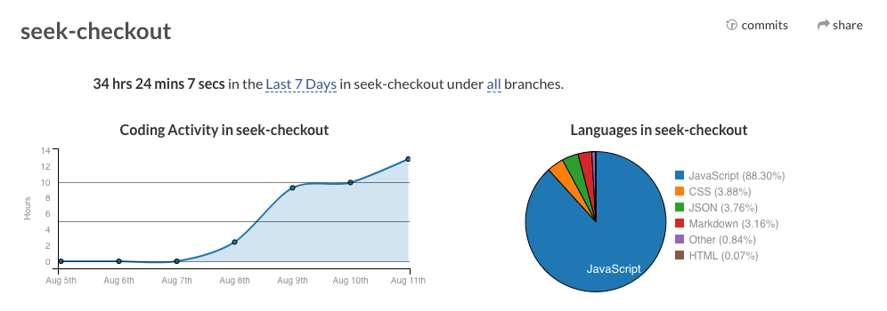

# SEEK Coding Exercise

This is my solution para the SEKK coding exercise.

## Images & Live Demo

You can see a live demo [here](https://seek-checkout.herokuapp.com/).

## Todo
- Refactor `calculator`;
- Create a more dynamic model `./model/price-rule.js` and `./model/checkout.js`;
- Create tests to `react` components;
- Remove `createCalculator()` from `total()` in `./model/checkout.js`;
- Review mobile design;

Coding activity: 34h [powered by wakatime](https://wakatime.com/i/kidchenko).

Cups of coffee: 14.

This project was bootstrapped with [Create React App](https://github.com/facebookincubator/create-react-app).

## What I learned in this exercise:
- React <3;
- I really could have use the time of a more efficient manner;
- Some patterns in JS, I decided to apply `decorator` pattern to calculate the `checkout price `;
- ~~Use react-router (Removed to simplify)~~;
- ~~Redux (I studied a lot, but I didn't implement)~~

## My pain points
- I think that I delivered a functional first version, it is not completely satisfactory version but works,
- I did not use time efficiently and I chose a path not so good for me and I was frozen for a long time;
- I am not fluent in React, so I think that this is one of the principal pain point, it consumed a lot of time because I was frozen at various times. But I'm not regret I learned a lot and think that I delivered a good react app;
- The cart rule is working, I really tried my best, but I have some points to improve;

Reactjs and me! :)

## Running in your machine

- `npm install` to install dependencies
- `npm start` to start

## Available Scripts

Below you will find some information on how to perform common tasks. 

- [Available Scripts](#available-scripts)
  - [npm start](#npm-start)
  - [npm test](#npm-test)
  - [npm run build](#npm-run-build)
  - [npm run eject](#npm-run-eject)

In the project directory, you can run:

### `npm start`

Runs the app in the development mode. 
Open [http://localhost:3000](http://localhost:3000) to view it in the browser.

The page will reload if you make edits. 
You will also see any lint errors in the console.

### `npm test`

Launches the test runner in the interactive watch mode. 
See the section about [running tests](#running-tests) for more information.

### `npm run build`

Builds the app for production to the `build` folder. 
It correctly bundles React in production mode and optimizes the build for the best performance.

The build is minified and the filenames include the hashes. 
Your app is ready to be deployed!

See the section about [deployment](#deployment) for more information.

### `npm run eject`

**Note: this is a one-way operation. Once you `eject`, you can’t go back!**

If you aren’t satisfied with the build tool and configuration choices, you can `eject` at any time. This command will remove the single build dependency from your project.

Instead, it will copy all the configuration files and the transitive dependencies (Webpack, Babel, ESLint, etc) right into your project so you have full control over them. All of the commands except `eject` will still work, but they will point to the copied scripts so you can tweak them. At this point you’re on your own.

You don’t have to ever use `eject`. The curated feature set is suitable for small and middle deployments, and you shouldn’t feel obligated to use this feature. However we understand that this tool wouldn’t be useful if you couldn’t customize it when you are ready for it.
